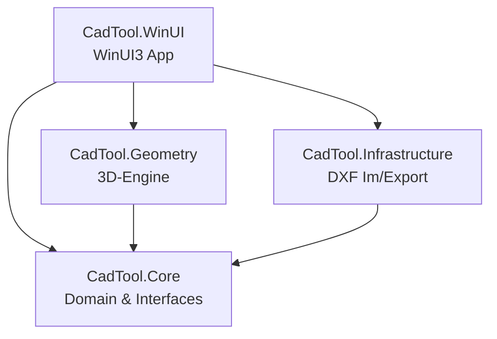
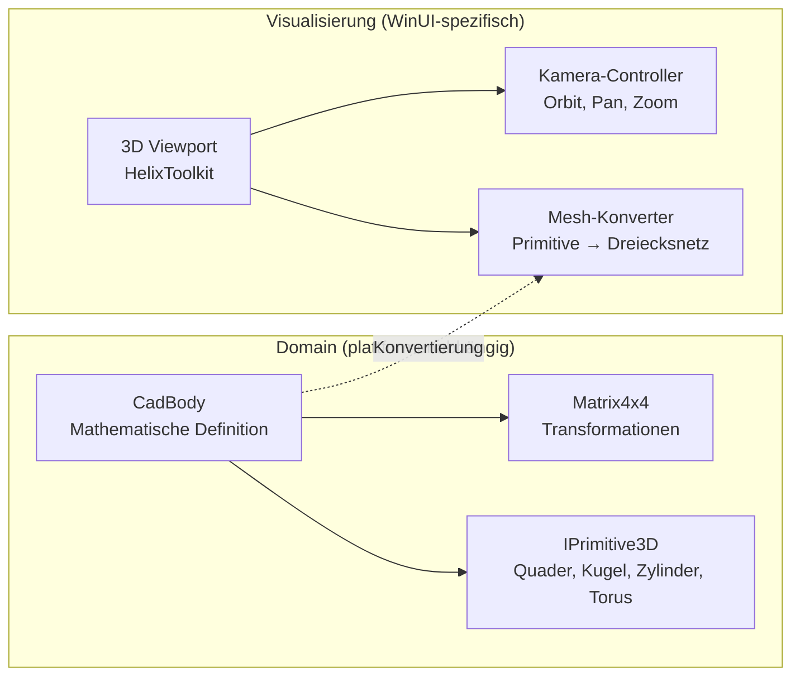

# Architektur – CadTool

## Überblick

CadTool ist ein 3D-CAD-Werkzeug für die Schärfung von schneidplattenbestückten Rotationswerkzeugen.
Die Architektur folgt dem Clean-Architecture-Prinzip mit strikter Trennung zwischen Domain-Logik,
Geometrie-Engine und Visualisierung.

## Koordinatensystem

- **Konvention:** Z-up (Maschinenbau-Standard)
- **Einheit:** Millimeter (mm)
- **Ursprung:** Werkzeugachse liegt auf der Z-Achse

## Projektstruktur

### CadTool.Core (Class Library)
- **Zweck:** Domain-Modell, Interfaces, mathematische Grundtypen
- **Abhängigkeiten:** Keine (reines .NET 8)
- **Inhalte:**
  - `Math/` – Vector3D, Matrix4x4, Plane3D, Line3D, BoundingBox3D
  - `Primitives/` – IPrimitive3D, BoxPrimitive, SpherePrimitive, CylinderPrimitive, TorusPrimitive
  - `Domain/` – CadBody, CadScene, ToolType
  - `Interfaces/` – IBooleanOperationService, IDxfService, ITransformService

### CadTool.Geometry (Class Library)
- **Zweck:** Implementierung der 3D-Geometrie-Logik
- **Abhängigkeiten:** CadTool.Core
- **Wichtig:** Keine Abhängigkeit zu WinUI/XAML – rein mathematisch
- **Inhalte:**
  - `Transforms/` – TransformService (Point-to-Point Move/Rotate)
  - `BooleanOps/` – BooleanOperationService (Union, Subtract, Intersect)
  - `Primitives/` – PrimitiveFactory

### CadTool.Infrastructure (Class Library)
- **Zweck:** Externe Schnittstellen (DXF-Dateien)
- **Abhängigkeiten:** CadTool.Core, netDxf (geplant)
- **Inhalte:**
  - `Dxf/` – DxfService (Import/Export)

### CadTool.WinUI (WinUI3 App)
- **Zweck:** Benutzeroberfläche und 3D-Viewport
- **Abhängigkeiten:** Alle anderen Projekte, Windows App SDK, HelixToolkit.WinUI (geplant)
- **Hinweis:** Nur auf Windows baubar

## Trennung: Werkzeug-Geometrie vs. Visualisierungs-Geometrie

Die **Werkzeug-Geometrie** (CadTool.Core + CadTool.Geometry) beschreibt Körper rein mathematisch
über Primitive, Transformationsmatrizen und Boole'sche Operationen. Diese Schicht hat keine
Abhängigkeit zu einer UI-Bibliothek.

Die **Visualisierungs-Geometrie** (CadTool.WinUI) konvertiert die mathematischen Definitionen
in renderfähige Dreiecksnetze (Meshes) für die GPU. Diese Konvertierung ist einweg und dient
ausschließlich der Darstellung.

## Abhängigkeitsregeln

1. `CadTool.Core` hat **keine** externen Abhängigkeiten
2. `CadTool.Geometry` referenziert **nur** `CadTool.Core`
3. `CadTool.Infrastructure` referenziert **nur** `CadTool.Core`
4. `CadTool.WinUI` referenziert alle anderen Projekte
5. Keine zirkulären Abhängigkeiten erlaubt

## Geplante externe Bibliotheken

| Bibliothek | Zweck | Lizenz | Projekt |
|---|---|---|---|
| netDxf | DXF-Dateien lesen/schreiben | MIT | CadTool.Infrastructure |
| HelixToolkit.WinUI | 3D-Viewport & Rendering | MIT | CadTool.WinUI |

## Nächste Schritte

1. **Phase 2:** Integration von netDxf für DXF-Import/Export
2. **Phase 3:** HelixToolkit.WinUI Integration für 3D-Viewport
3. **Phase 4:** CAD-Operationen (Point-to-Point Transformationen, DXF→3D-Kurven)
