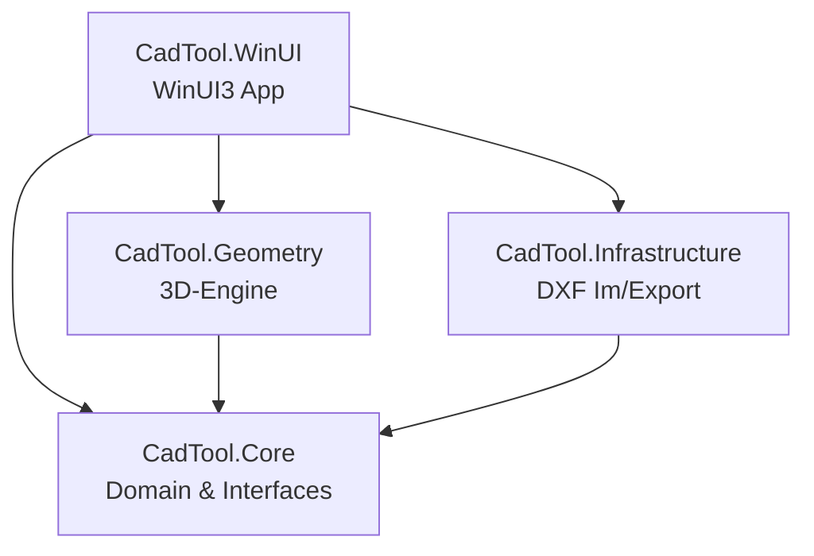
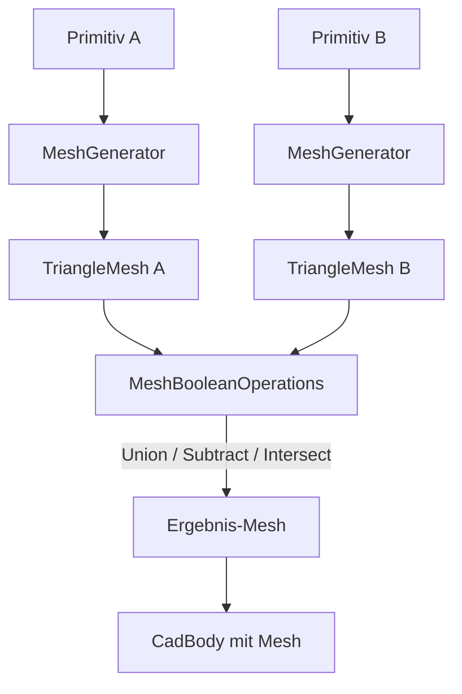
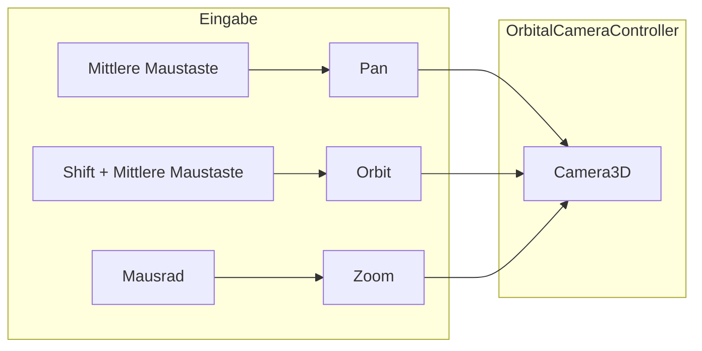
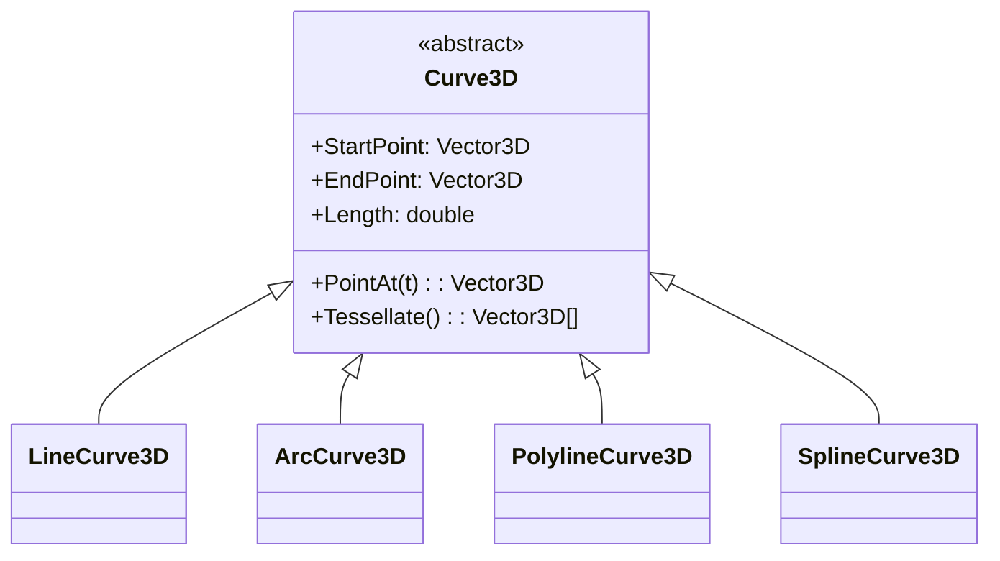

# Architektur – CadTool

## Überblick

CadTool ist ein 3D-CAD-Werkzeug für die Schärfung von schneidplattenbestückten Rotationswerkzeugen.
Die Architektur folgt dem Clean-Architecture-Prinzip mit strikter Trennung zwischen Domain-Logik,
Geometrie-Engine und Visualisierung.

## Koordinatensystem

- **Konvention:** Z-up (Maschinenbau-Standard)
- **Einheit:** Millimeter (mm)
- **Ursprung:** Werkzeugachse liegt auf der Z-Achse

## Projektstruktur

### CadTool.Core (Class Library, .NET 10)
- **Zweck:** Domain-Modell, Interfaces, mathematische Grundtypen
- **Abhängigkeiten:** Keine (reines .NET 10)
- **Inhalte:**
  - `Math/` – Vector3D, Matrix4x4, Plane3D, Line3D, BoundingBox3D
  - `Mesh/` – Triangle3D, TriangleMesh (Dreiecksnetz für CSG-Ergebnisse)
  - `Primitives/` – IPrimitive3D, BoxPrimitive, SpherePrimitive, CylinderPrimitive, TorusPrimitive
  - `Curves/` – Curve3D, LineCurve3D, ArcCurve3D, PolylineCurve3D, SplineCurve3D (B-Spline mit De-Boor)
  - `Viewport/` – Camera3D, IViewport3D, ProjectionType
  - `Domain/` – CadBody (mit optionalem Mesh), CadScene, ToolType
  - `Interfaces/` – IBooleanOperationService, IDxfService, ITransformService

### CadTool.Geometry (Class Library, .NET 10)
- **Zweck:** Implementierung der 3D-Geometrie-Logik
- **Abhängigkeiten:** CadTool.Core
- **Wichtig:** Keine Abhängigkeit zu WinUI/XAML – rein mathematisch
- **Inhalte:**
  - `Mesh/` – MeshGenerator (Primitive→Dreiecksnetz), MeshBooleanOperations (CSG: Union, Subtract, Intersect)
  - `Transforms/` – TransformService (Point-to-Point Move/Rotate)
  - `BooleanOps/` – BooleanOperationService (vollständige CSG-Integration)
  - `Viewport/` – OrbitalCameraController (Orbit, Pan, Zoom im AutoCAD-Style)
  - `Curves/` – DxfCurveConverter (DXF-Daten → 3D-Kurven)
  - `Primitives/` – PrimitiveFactory

### CadTool.Infrastructure (Class Library, .NET 10)
- **Zweck:** Externe Schnittstellen (DXF-Dateien)
- **Abhängigkeiten:** CadTool.Core, netDxf
- **Inhalte:**
  - `Dxf/` – DxfService (Import/Export mit netDxf: 3DFACE-Entitäten, Polylinien, Wireframes)

### CadTool.WinUI (WinUI3 App, .NET 10-windows)
- **Zweck:** Benutzeroberfläche und 3D-Viewport
- **Abhängigkeiten:** Alle anderen Projekte, Windows App SDK, HelixToolkit.WinUI (geplant)
- **Hinweis:** Nur auf Windows baubar

## Mesh-basierte CSG-Operationen

Die Boole'schen Operationen arbeiten auf Dreiecksnetzen:
1. **MeshGenerator** konvertiert Primitive (Box, Sphere, Cylinder, Torus) in TriangleMeshes
2. **MeshBooleanOperations** führt CSG-Operationen aus (Ray-Casting mit Majority-Vote für Robustheit)
3. Das Ergebnis ist ein neuer CadBody mit dem resultierenden Mesh

## Kamera-Steuerung (AutoCAD-Style)

## 3D-Kurven (DXF→3D)

Der **DxfCurveConverter** konvertiert DXF-Geometrie-Daten (Linien, Bögen, Splines) in die internen 3D-Kurven-Typen.

## Trennung: Werkzeug-Geometrie vs. Visualisierungs-Geometrie

Die **Werkzeug-Geometrie** (CadTool.Core + CadTool.Geometry) beschreibt Körper rein mathematisch
über Primitive, Dreiecksnetze, Transformationsmatrizen und Boole'sche Operationen. Diese Schicht hat keine
Abhängigkeit zu einer UI-Bibliothek.

Die **Visualisierungs-Geometrie** (CadTool.WinUI) nutzt die TriangleMeshes direkt für die GPU-Darstellung
und verbindet die OrbitalCameraController-Logik mit der konkreten Mauseingabe.

## Abhängigkeitsregeln

1. `CadTool.Core` hat **keine** externen Abhängigkeiten
2. `CadTool.Geometry` referenziert **nur** `CadTool.Core`
3. `CadTool.Infrastructure` referenziert **nur** `CadTool.Core` + netDxf
4. `CadTool.WinUI` referenziert alle anderen Projekte
5. Keine zirkulären Abhängigkeiten erlaubt

## Externe Bibliotheken

| Bibliothek | Version | Zweck | Lizenz | Projekt |
|---|---|---|---|---|
| netDxf | 2023.11.10 | DXF-Dateien lesen/schreiben | MIT | CadTool.Infrastructure |
| HelixToolkit.WinUI | (geplant) | 3D-Viewport & Rendering | MIT | CadTool.WinUI |
